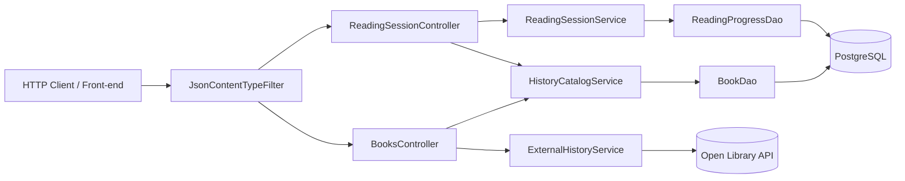

# HistoryShelf MVC Data Flow Diagram

## Dispatch and Data Flow Notes
1. Client request enters filter, which enforces JSON response type.
2. Controller parses HTTP method and payload.
3. Controller delegates business logic to service layer.
4. Services call DAO classes for persistence.
5. DAO executes SQL against PostgreSQL and returns model objects.
6. Controllers serialize model data as JSON back to client.
